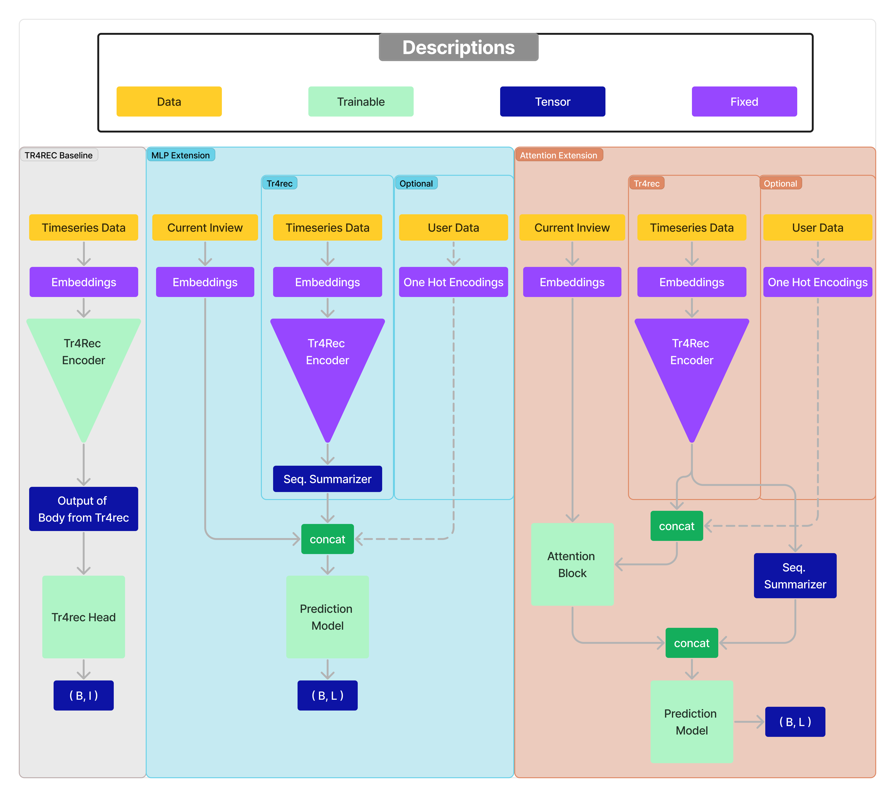
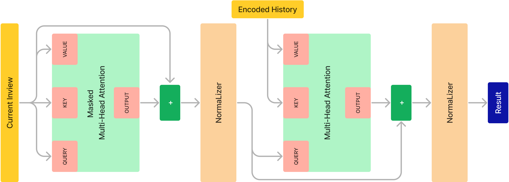

# News-Recommender-Recsys24
RecSys @ University of Amsterdam '24

Theofanis Aslanidis - Vasilis Karlis - Akis Lionis

## Introduction
This work examines and extends the Transformers4Rec library's impact in second-stage recommendation problems, where the ranking of items is based not only on the user's history but also on what the user sees in its current inview. Finally, this work explores how non-sequential features such as user meta-data can be ingested in the transformers4rec library and whether such features will impact the performance.


Our contribution lies in the addition of trainable components able to capture information about the user and the inviews, respectively. We provide two model architectures: the MLP and Cross Attention models.

*Attention Extension Model*. As attention layers can capture more in-depth information, we inserted attention in our architecture, as shown in the figure below. The first step is to utilize the baseline TR4REC model to encode the time series embeddings. Afterward, along with the encoded inviews, the encoded user history, and user metadata, are passed through an attention block, described by the figure below. The attention block is composed of a self-attention that takes the inview embeddings alongside a mask to counter the padding and also by cross attention that takes the inview embeddings and the baseline with user data and outputs an encoding for each inview. This way, the attention mechanism can learn the importance of each article in the inview, and provide a
better inview representation. Lastly, to calculate the probability of clicking each inview article, we use a sequence summary of the time-series encoding, concatenated with the output of the attention block, as inputs to a two-layer MLP, with 64 nodes in the in-between layer. The MLP predicts the click probability of every inview article, achieving a size of output length of max inviews per batch, achieving the output (𝐵, 𝐿)




## Reproducibility

1. Run `download_data.sh`
2. Download the checkpoints from the provided link
3. Run Preprocessing
4. Run Inference on our trained version of Tr4Rec (~5 mins on NVIDIA A100 GPU)
5. Train and Test our extension (~10 mins on NVIDIA A100 GPU)

## Pre-Trained

Checkpoints: https://amsuni-my.sharepoint.com/:f:/g/personal/theofanis_aslanidis_student_uva_nl/EsgSoaTdU7xPinW1OS0MQTgB3OqYg5Lkqo_ih0rmTzgpuA?e=5fTr5b

Download and place in the folder ./checkpoints

The structure should be

```
checkpoints
├── enriched
│   ├── small
│   ├── large
```
## Conda Environment

`install_env_cluster.job` and activate with `source activate transformers4rec_v2_akis`

## Data Pre-Processing

`python tr4rec/pre_process.py --split small --data_category train --history_size 20 --dataset_type enriched`

`python tr4rec/pre_process.py --split small --data_category validation --history_size 20 --dataset_type enriched`

## Tr4Rec Train

`python tr4rec/train.py --split small --history_size 20 --epochs 20 --dataset_type enriched`

## Tr4Rec Evaluation

`python tr4rec/eval.py --split small --data_category validation --path ./checkpoints/enriched/small/checkpoint-226/pytorch_model.bin --dataset_type enriched`

## Extension Train & Test

`python tr4rec/extension_train_test.py --split small --extension_model attn --epochs 2`
